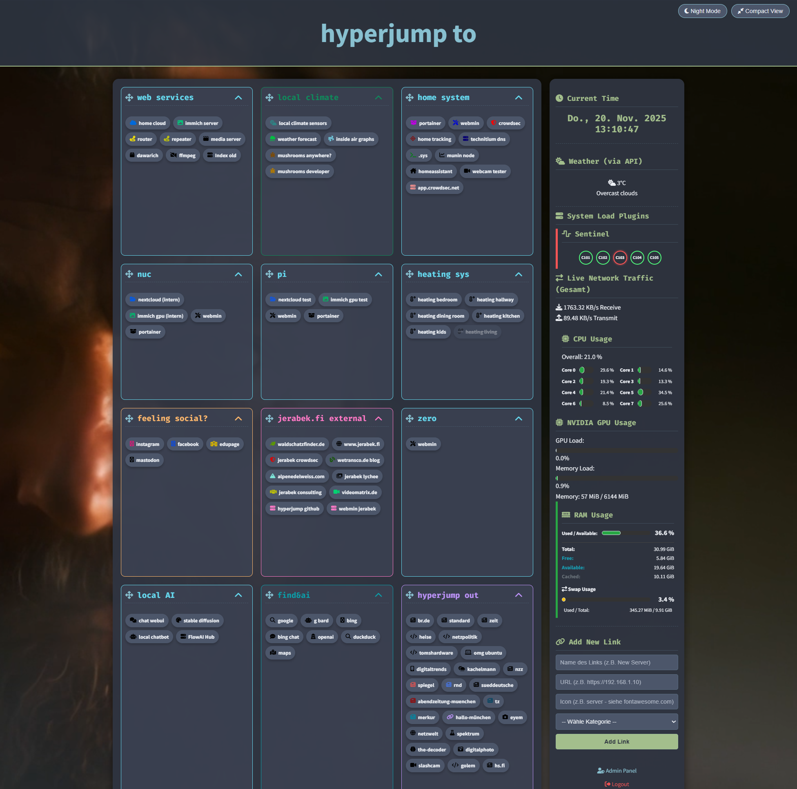

HyperJump - Das personalisierte Startseiten-Dashboard

Eine Demo ist hier zu sehen und zu nutzen:

https://axel.jerabek.fi/hyperjump_demo/

Demo-Passwort: jabittetest

HyperJump ist eine einfache, hochgradig anpassbare, Single-Page-Anwendung (SPA) in PHP, HTML und CSS. Sie dient als zentrale Startseite oder Dashboard, um schnell auf die wichtigsten Links und internen Dienste zuzugreifen. Das Design legt Wert auf eine saubere, moderne Ästhetik und schnelle Ladezeiten.

Das Projekt ist für die Veröffentlichung vorbereitet, alle privaten URLs, Passwörter und API-Schlüssel wurden entfernt bzw. anonymisiert, um eine sichere, öffentliche Codebasis zu gewährleisten.

🛠 Technologie-Stack

Backend/Logik: PHP (Minimal und Vanilla)

Frontend/Struktur: HTML5

Styling: CSS3 (Fokus auf Responsiveness und modernes Design)

Interaktivität: Vanilla JavaScript

Datenhaltung: JSON-Dateien (data.php, order.json)

✨ Hauptfunktionen

Kategorisierte Link-Bubbles: Links werden in klaren, faltbaren Kategorien (Bubbles) organisiert, wobei jede Kategorie eine definierte Farbe hat.

Sofortige Zugänglichkeit: Dank der Optimierungen sind die Links sofort nach dem Laden der Seite ohne Verzögerung sichtbar.

Admin-Dashboard: Ein passwortgeschützter Administrationsbereich (admin.php) zur Verwaltung der Links.

Echtzeit-Sortierung: Links und Kategorien können per Drag-and-Drop neu sortiert werden, wobei die Reihenfolge in order.json gespeichert wird.

Responsive Design: Optimiert für die Nutzung auf Desktops, Tablets und besonders auf mobilen Geräten.

⚙️ Administration & Datenmanagement

Das Herzstück der Anpassung ist das Admin-Dashboard, geschützt durch ein Passwort, das als SHA256-Hash in der config.php gespeichert ist.

Dateien im Überblick

Datei

Beschreibung

Anmerkung (Public Version)

index.php

Die Hauptansicht/Startseite. Stellt das Dashboard dar.

Vollständig veröffentlicht.

data.php

Enthält alle Link-Kategorien und die zugehörigen Link-Daten (URL, Text, Icon, Farbe).

Anonymisiert. Nur Platzhalter-Links und Texte enthalten.

order.json

Speichert die vom Benutzer definierte Reihenfolge der Kategorien und der Links innerhalb dieser Kategorien.

Anonymisiert. Speichert die Struktur mit Platzhalter-Namen.

config.php

Enthält Session-Start, Login-Status und systemweite Konstanten (z.B. Passwort-Hash, API-Keys).

Bereinigt. Passwort-Hash und alle API-Schlüssel sind entfernt.

admin.php

Die Oberfläche für die Link-Verwaltung (Hinzufügen, Bearbeiten, Löschen).

Vollständig veröffentlicht.

styles2.css

Alle CSS-Styles für das Dashboard und das Admin-Panel.

Vollständig veröffentlicht.

Link-Struktur (data.php Format)

Jede Kategorie hat einen eindeutigen Schlüssel (key), einen Titel (title), eine Standardfarbe (color) und ein Array von Links:

$categories = [
    'category_key' => [
        'title' => 'Titel der Kategorie',
        'color' => '#HEXCODE', 
        'links' => [
            [
                'url' => '[https://example.com](https://example.com)',
                'text' => 'Name des Links',
                'icon' => 'globe', // Font-Awesome-Icon-Name
                'disabled' => false,
                'color' => '#HEXCODE' // Optionale individuelle Farbe
            ],
            // ... weitere Links
        ],
    ],
    // ... weitere Kategorien
];

🚀 Installation & Betrieb

Dateien klonen: Klonen Sie dieses Repository auf Ihren Webserver in das gewünschte Verzeichnis.

Webserver: Stellen Sie sicher, dass ein Webserver (z.B. Apache, Nginx) mit PHP-Unterstützung (empfohlen: PHP 7.4+) läuft.

Zugangsdaten konfigurieren (WICHTIG): Bevor Sie das Dashboard nutzen, müssen Sie die Datei config.php bearbeiten.

🔐 3.1 Admin-Passwort festlegen

Um den passwortgeschützten Admin-Bereich (admin.php) zu nutzen, müssen Sie ein gehashtes Passwort in die config.php eintragen. Wir verwenden SHA256, um Passwörter sicher zu speichern.

Hash generieren: Rufen Sie die Datei /hash_generator.php in Ihrem Browser auf (z.B. http://localhost/hyperjump/hash_generator.php).

Geben Sie Ihr gewünschtes Admin-Passwort ein und klicken Sie auf Generieren.

Kopieren Sie den generierten SHA256-Hash.

Öffnen Sie die Datei config.php und fügen Sie den Hash in die Konstante ADMIN_PASSWORD ein:

define('ADMIN_PASSWORD', 'HIER_DEN_KOPIERTEN_HASH_EINFÜGEN'); 

☁️ 3.2 Wetter-Funktionalität einrichten

Die optionale Wetter-Funktion (nutzt get_weather.php und weather_cache.json) benötigt einen API-Schlüssel von OpenWeatherMap.

API-Key anfordern:

Registrieren Sie sich oder melden Sie sich bei OpenWeatherMap an.

Navigieren Sie zu My API keys (unter Ihrem Profil) und generieren Sie einen neuen Schlüssel.

Konfiguration anpassen:

Öffnen Sie die Datei config.php.

Fügen Sie den Schlüssel in die Konstante WEATHER_API_KEY ein und passen Sie Ihre Stadt-ID an:

define('WEATHER_API_KEY', 'IHR_OPENWEATHERMAP_API_KEY');
define('WEATHER_CITY_ID', 'IHRE_STADT-ID_HIER'); 

Die Stadt-ID (WEATHER_CITY_ID) finden Sie, indem Sie auf OpenWeatherMap nach Ihrer Stadt suchen und die ID aus der Browser-URL kopieren.

Admin-Bereich aufrufen: Klicken sie im widget rechts unten auf "Admin" oder besuchen Sie /admin.php in Ihrem Browser, um sich anzumelden und die Platzhalter-Links durch Ihre eigenen, tatsächlichen Links zu ersetzen.
